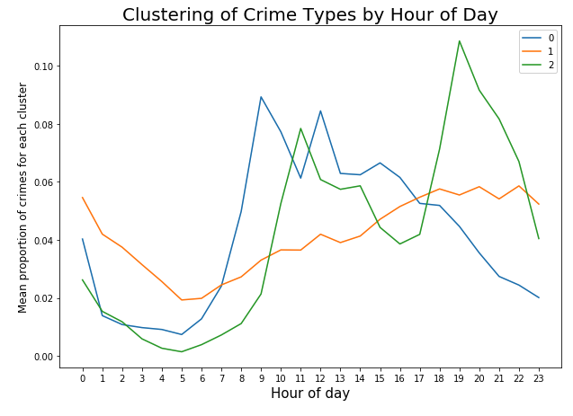

## Machine Learning

  

Screenshot from clustering exercise with crime data from Chicago. Crimes were clustered based on when the majority of different types of crimes are committed. The model revealed that crimes sharing certain characteristics (such as severity or nature of the crime) exhibit similar patterns in temporal distribution.

### Overview

This repo contains exercises and projects I completed for Machine Learning for Cities at NYU in the Spring of 2019. We used a variety of machine learning modelling techniques, like decision trees, SVMs, K-means clustering, and Gaussian Process anomaly detection to understand historical patterns in large datasets and form predictions for the future.

Also check out my repos [nyuProjects](https://github.com/seeess1/nyuProjects "nyuProjects") and [bigData](https://github.com/seeess1/bigData "bigData") for more projects and work samples.